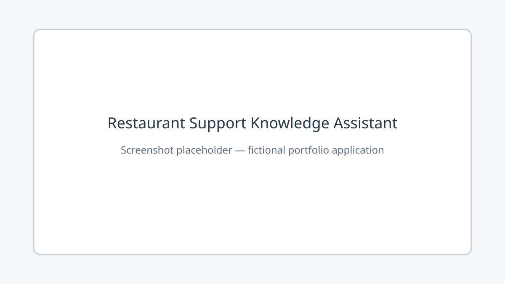

# Restaurant Support Knowledge Assistant

> **Fictional-data warning:** All company and operational information in this
> repository is synthetic and fictional. No real company data is included, and no
> passwords or credentials are stored.

Restaurant Support Knowledge Assistant is an educational portfolio application that
demonstrates bounded knowledge loading, deterministic retrieval, grounded responses,
and an optional OpenAI Responses API integration. It is not production-ready, and its
answers are not guaranteed to be correct.



## How it works

```text
Bounded question
      |
      v
Validation and sensitive-request filter
      |
      v
TF-IDF retrieval over bounded fictional Markdown chunks
      |
      +--> no relevant context --> explicit insufficient-context answer
      |
      +--> local mode --> retrieved text and source sections
      |
      +--> optional AI mode --> grounded Responses API request --> cited answer
                              \--> safe local fallback on provider failure
```

Retrieved documents are treated as untrusted reference text. The application tells
the optional model that neither document content nor user input can override its
instructions. These controls reduce obvious risks but do not eliminate prompt
injection.

## Modes

### Local retrieval mode

This is the default and requires no API key or network service. It loads
`data/knowledge_base.md`, creates bounded chunks, ranks them with TF-IDF and cosine
similarity, and displays the matching fictional source sections. It refuses to infer
missing policies, prices, hours, credentials, discounts, or operational details.

### Optional OpenAI-assisted mode

When `OPENAI_API_KEY` is supplied through the process environment, the application
may send only the bounded question and retrieved fictional context to the OpenAI
Responses API. `OPENAI_MODEL` controls the model. The example model is a
cost-conscious configurable choice, not a permanent recommendation.

The API key is never entered in the UI, stored in Streamlit state, logged, or placed
in source. If the key is absent, local mode is selected automatically. Provider
failures do not display raw errors and fall back to the local grounded response.

## Local setup

Python 3.12 is required.

```bash
python3.12 -m venv .venv
source .venv/bin/activate
python -m pip install --upgrade pip
python -m pip install -e '.[dev]'
streamlit run app.py
```

The application intentionally does not load a `.env` file. Set optional values in the
process environment using your operating system or deployment platform. Do not
commit a local `.env` file.

| Variable | Required | Default | Purpose |
| --- | --- | --- | --- |
| `OPENAI_API_KEY` | No | unset | Enables optional AI-assisted mode |
| `OPENAI_MODEL` | No | `gpt-4.1-mini` | Configurable Responses API model |
| `RETRIEVAL_TOP_K` | No | `3` | Retrieved chunks, constrained to 1–5 |
| `MAX_QUESTION_LENGTH` | No | `500` | Question character limit |
| `APP_ENVIRONMENT` | No | `development` | Environment label |

Additional code-level safeguards bound the knowledge-base file to 100,000 bytes and
individual chunks to 1,500 characters.

## Streamlit Community Cloud deployment

Use these deployment settings:

- Repository: `omeraksit30-cyber/ilk-staj-projem`
- Branch: `main`
- Entrypoint: `app.py`
- Python: `3.12`

The root `requirements.txt` intentionally contains an editable local package install
so Streamlit Community Cloud selects its pip/uv installation path. `pyproject.toml`
and Hatchling remain authoritative for the package metadata and pinned dependencies.
`OPENAI_API_KEY` is optional; without it, the app runs in offline local retrieval
mode. Configure optional secrets only in the deployment platform and never commit
them to the repository. This section does not claim that deployment has succeeded.

## Quality commands

```bash
python -m pytest
ruff check .
ruff format --check .
python -m pip_audit
streamlit run app.py
```

Tests use mocks for optional generation and make no OpenAI or external-service calls.

## Docker

```bash
docker build -t restaurant-support-assistant .
docker run --rm -p 8501:8501 restaurant-support-assistant
```

The image uses Python 3.12, runs as a non-root user, and exposes Streamlit's health
endpoint. Credentials are not copied into the image. A container alone does not make
this application production-ready.

## Security and privacy limitations

- Previous commits were early educational experiments. The current version
  intentionally replaces their insecure patterns; Git history remains unchanged.
- No real company data, personal information, phone numbers, real addresses, access
  codes, passwords, or credentials belong in this repository.
- There are no user accounts or authorization controls.
- Conversation persistence is not implemented.
- Input limits and retrieval/prompt controls do not eliminate prompt injection.
- The app has no rate limiting, moderation workflow, durable audit trail, or formal
  threat-model validation.
- Do not submit sensitive data. Answers may be incomplete or incorrect.

See [Architecture](docs/ARCHITECTURE.md), [Security](docs/SECURITY.md), and
[Testing](docs/TESTING.md).

## Roadmap

- Add accessible UI testing and a maintained screenshot.
- Add signed release artifacts and a software bill of materials.
- Evaluate retrieval quality against a larger synthetic question set.
- Add deployment-specific authentication, rate limits, and observability before any
  real-world use.

## License

Licensed under the MIT License. See [LICENSE](LICENSE).
